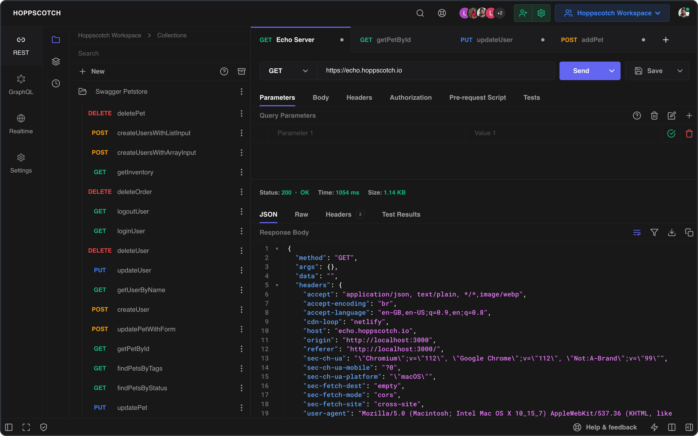

# Hoppscotch CI/CD pipeline

Deploy Hoppscotch server with CI/CD on Elestio

 
 

# Important

During deployment you will receive an email from Hoppscotch, the link will not be valid but will prove that you are registered as an administrator.

# Once deployed ...

You can open Hoppscotch here:

    URL: https://[CI_CD_DOMAIN]
    email: [ADMIN_EMAIL]

You can open Hoppscotch Admin here:

    URL: https://[CI_CD_DOMAIN]:8443
    email: [ADMIN_EMAIL]

You can open pgAdmin web UI here:

    URL: https://[CI_CD_DOMAIN]:8443
    email: [ADMIN_EMAIL]
    password: [ADMIN_PASSWORD]
